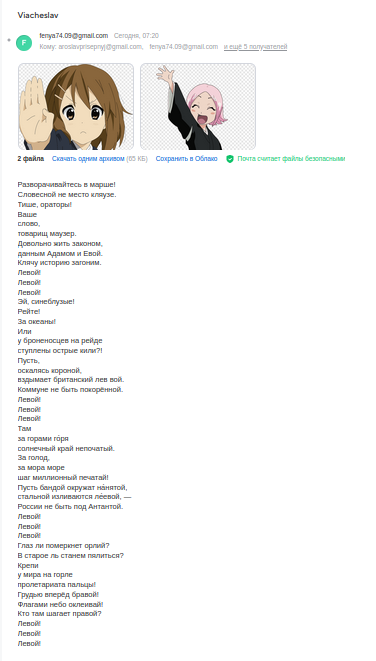
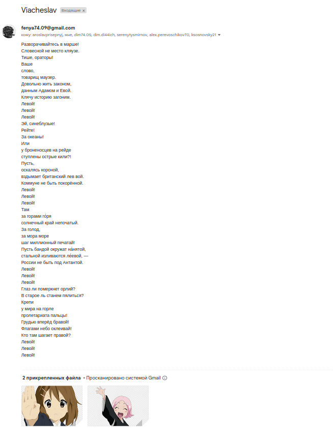
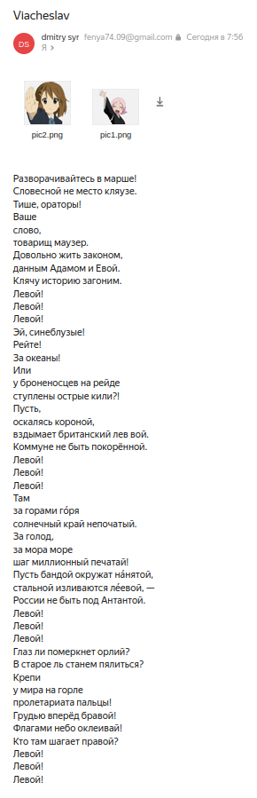

# smtp-клиент
Организует рассылку электронных писем, используя протокол SMTP  

## требования
- python3

## Настройка
производится в файле **config.py** (см. комментарии в нем)

## запуск
```commandline
python3 smtp_client.py
```

## результаты рассылки


